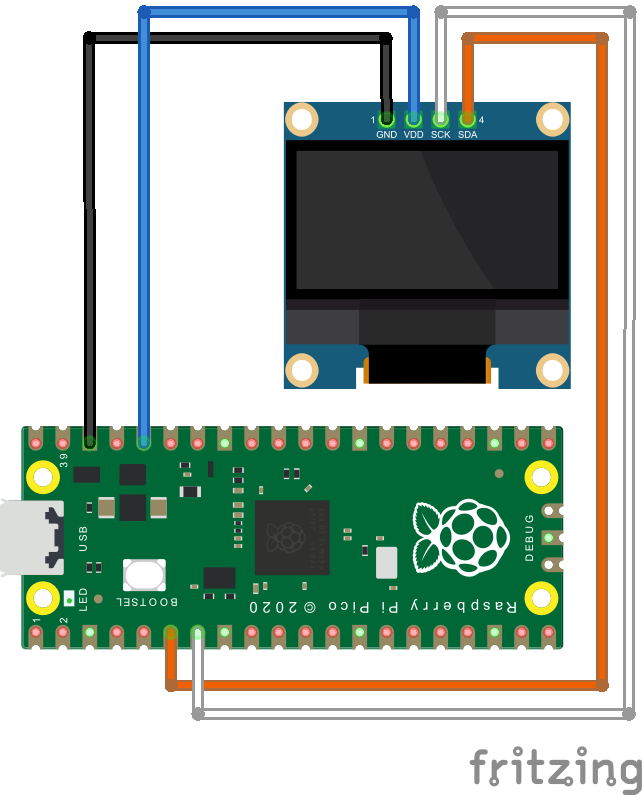

# OpenHaardVuur

> Hogeschool Utrecht
> Instituut voor ICT
> Technische Informatica

Kerst project: open haard vuur animatie op een OLED display.


## Hardware

You need the following items. See also our [challange](challange.md) for a walktrough on how to obtain these items.

- 1 x Raspberry Pi PICO or PICO-W
- 1 x OLED display 128 x 64 pixel (16 rows yellow, 48 rows blue)
- 4 x Dupont cable female-female

(Alternatively you can also use a breadboard and other cable types.)

## Hardware Setup

> Before making any connections, make sure your Raspberry Pi Pico is powered-off.

You need to make these four connections:

| RasPi Pico | OLED display | function                                   |
|------------|--------------|--------------------------------------------|
| GND        | GND          | Ground (0V, required to close the circuit) |
| GP4        | SDA          | I2C Serial Data                            |
| GP5        | SCK          | I2C Serial Clock                           |
| 3V3        | VDD          | Power Supply (3.3V) for the OLED display   |



## Software

You need:

- Python (we tested with 3.11 or later)
- PyCharm Community Edition (we tested with 2024.1.14 or later)

If you installed these already, you are [good to go](#build-and-flash), otherwise we'll install them in the next section.

- Optional: Git (then you can clone the repository instead of downloading and unpacking a ZIP file)

## Project Setup

We install the necessary tools to build the project and make the necessary settings to build and flash it.

1. Get this project (download a ZIP file and unpack it somewhere, or use git to clone it.)
    - Pro Tip:
        - Make a top-level 'Repo' directory on your computer your development repositories,
          (e.g. in `C:\Repo`).
        - Make a folder `gitlab` and clone (or unpack from a ZIP file) this project within
          (e.g. in `C:\Repo\gitlab\openhaardvuur`).

2. Install Python (e.g. 3.12 or later) on your computer.
    - Pro Tip:
        - make a top-level 'Dev' directory on your computer for all your development software,
          (e.g. in `C:\Dev`).
        - make a folder `Python` and install Python inside this folder
          (e.g. in `C:\Dev\Python\Python3.12`),
          so you can have multiple Python versions if you need them.

3. Install the current version of the PyCharm Community Edition (e.g. 2024.1.4)
   (e.g. in `C:\Dev\JetBrains\PyCharm-CE-2024.1.4`).

4. Open PyCharm and choose 'Project' > 'Open' from the launcher
   (or [Three-lines Menu] > 'File' > 'Open' from the main window if you have an open project already),
   then find the `pico` folder in the `openhaardvuur` folder and open it
   (in our example this is in `C:\Repo\gitlab\openhaardvuur\pico`).

5. Check or install the PyCharm plugin for MicroPython:
    - Navigate to the [PyCharm Menu] > 'Settings' > 'Plugins'
    - if it is not already installed: get 'MicroPython' from the 'Marketplace'

6. Select a Python Interpreter for the project:
    - Navigate to the [PyCharm Menu] > 'Settings' > 'Project: openhaardvuur' > 'Python Interpreter'.
    - Select the Python interpreter you installed in Step 2.
    - If the interpreter is not shown in the drop-down list, find it with 'Add'.

7. Enable MicroPython for the 'openhaardvuur' project:
    - Navigate to the [PyCharm Menu] > 'Settings' > 'Languages and Frameworks' > 'MicroPython'
    - Enable (check) 'Enable MicroPython support'
    - For 'Device type:' select 'Raspberry Pi Pico'
    - Enable (check) 'Auto-detect device path'
    - Click 'Apply' and then 'OK'

8. Mark the 'Sources Root' folder in your project:
    - In PyCharm, in the 'Project' window, below 'openhaardvuur', right-click on the folder 'pico'
    - From the context menu, select 'Mark Directory as' > 'Sources Root'.
    - The folder icon for 'pico' should now be blue.
      This tells MicroPython that only this directory (and all files and folders within) must be
      copied to the Raspberry Pi Pico. It also makes sure that 'main.py' is in the Pico's "root folder".
      On Power-Up, the Raspberry Pi Pico will check if it has a 'main.py' in its root folder.
      If you place your project 'main.py' somewhere else, it will not be executed.
   > If you change your code and flash it to the Raspberry Pi Pico, but it looks like
   > your changes are not executed, check if this setting is correct.

9. Create a 'Run Configuration' for flashing everything to the Pico:
    - In PyCharm, in the Main window, on the top right, left of a gray 'Play' button is a dropdown
      that shows 'Current File' (at least for a new project).
    - Select this dropdown, and you should see the options 'Current File' and 'Edit Configurations...'.
    - Choose 'Edit Configurations...', and the dialog window 'Run/Debug Configurations' should open.
    - Add a new configuration with the '+' (plus) sign (it's top-left, under the PyCharm icon).
    - Select 'MicroPython'. This opens 'MicroPython/Flash' settings.
    - In the 'Name:' field (shows 'Flash') change the text to 'Flash pico'.
    - Right of the (empty) 'Path:' field is a small folder icon. Click on it and browse to the location
      of your 'pico' folder e.g. `C:\Repo\gitlab\openhaardvuur\pico`.
    - Optional: you can enable 'Open MicroPython REPL on success', but we don't necessarily need it for this project.
    - In any case, leave the other settings untouched (the entry 'Before launch: Stop MIcroPython REPL' is important to
      keep).
    - Click 'Apply' and 'OK'.

## Build and Flash

Phew. The preparation took quite some steps!

At least now it should be easy to upload (flash) the project to the Raspberry Pi Pico.

1. **Make sure your Raspberry Pi Pico is configured with MicroPython.** (When you get this project, this should already
   be the case.)

   If you have a brand-new never-touched Raspberry Pi Pico (or Pico-W), you need to download the matching MicroPython
   package for it.

   Installing this is not difficult (you basically copy a file into a folder on the Pico).

   But you do need to make sure you have the correct MicroPython variant for your Pico type.

2. **Make sure your Raspberry Pi Pico is connected to your Laptop/PC via USB.**

3. In PyCharm, in the Main window, on the top right, left of a gray 'Play' button, make sure you have 'Flash pico'
   selected.
   (If not, select it from the dropdown. If it's not there, check the 'Project Setup' step to make this 'Run
   Configuration'.)  
   **Then press the 'Play' button.**

You should now get a 'Run' window with the name '[Micropython logo] Flash pico' that shows something like this:

```text
C:/Dev/Python/Python312/python.exe C:\Users\testuser\AppData\Roaming\JetBrains\PyCharmCE2024.1\plugins\intellij-micropython/scripts/microupload.py -C C:/Repo/gitlab/openhaardvuur/pico -v COM17 C:\Repo\gitlab\openhaardvuur\pico
Connecting to COM17
Uploading files: 0% (0/6)
C:\Repo\gitlab\openhaardvuur\pico\main.py -> main.py
Uploading files: 16% (1/6)
C:\Repo\gitlab\openhaardvuur\pico\ssd1309.py -> ssd1309.py
Uploading files: 33% (2/6)
C:\Repo\gitlab\openhaardvuur\pico\px128w64h\vuur0.mono -> px128w64h/vuur0.mono
Uploading files: 50% (3/6)
C:\Repo\gitlab\openhaardvuur\pico\px128w64h\vuur1.mono -> px128w64h/vuur1.mono
Uploading files: 66% (4/6)
C:\Repo\gitlab\openhaardvuur\pico\px128w64h\vuur2.mono -> px128w64h/vuur2.mono
Uploading files: 83% (5/6)
C:\Repo\gitlab\openhaardvuur\pico\px128w64h\vuur3.mono -> px128w64h/vuur3.mono
Uploading files: 100% (6/6)
Soft reboot
```

If you enabled 'Open MicroPython REPL on success', you will only see this output for a brief moment, then you get the
MicroPython REPL screen.

If you did not enable 'Open MicroPython REPL on success', you can open it now by clicking on the MicroPython symbol on
the left of the output window.

```text
Device path COM17
Quit: Ctrl+] | Stop program: Ctrl+C | Reset: Ctrl+D
Type 'help()' (without the quotes) then press ENTER.
Traceback (most recent call last):
  File "main.py", line 107, in <module>
KeyboardInterrupt: 
MicroPython v1.19.1 on 2022-06-18; Raspberry Pi Pico with RP2040
Type "help()" for more information.
>>> 
```

Opening the MicroPython REPL will stop program execution.
On the OLED display you will probably see the 'welcome screen' of the project, with some text on it.

You can now click inside the REPL window and type some commands, for example:

```text
>>> dir()
['I2C', 'i2c', 'prepare_fireplace_animation', 'machine', 'I2C_SDA', 'FRAME_SLEEP', 'pico_selftest', 'display', 'I2C_FRQ', 'show_welcome_banner', 'rp2', 'test_fireplace_animation', 'play_fireplace_animation', 'sleep_ms', 'Display', 'Pin', '__name__', 'I2C_SCL']
```

Like on the normal Python REPL (on your PC), you can also use your Raspberry Pi Pico as a little calculator:

```text
>>> 2 + 7
9
```

Hmmm... but how do we run our program again?

Try this:

```text
>>> import main
```

Tip: If you click on the 'Play' icon on the left of the output window (hover tip 'Run'), you are taken back to the '
Run' 'Flash pico' screen with the information about flashing.

### Files on the Raspberry Pi Pico

MicroPython supports a file system. The files and directories on there can be listed and changed via a program (or the
REPL) via the 'os' package.

The layout of the files we flash onto the Pico looks like this:

- MicroPython root file system ('Sources Root')
    - `main.py` -- our main program, this is automatically executed by the Raspberry Pi Pico (and the Pico-W) on
      power-up
    - `ssd1309.py` -- the library that main.py uses to talk to the OLED 128 x 64 pixel display
    - `px128w64h` -- directory with bitmap files for a display that is 128 pixels wide and 64 pixels high
        - `vuur0.mono` -- 1st animation frame of the 'fire' animation
        - `vuur1.mono` -- 2nd animation frame of the 'fire' animation
        - `vuur2.mono` -- 3rd animation frame of the 'fire' animation
        - `vuur3.mono` -- 4th animation frame of the 'fire' animation

### Tips & Tricks and FAQs

Q: **Flashing takes so long. Can we make this faster?**

A: If you don't want to flash all files all the time, you can add more 'Run/Debug Configurations'.

- For development it's useful to add a configurations 'Flash main.py' to flash only the file main.py.
- Instead of a directory, in 'Path:' you just select the file you want to flash in the configuration dialog.

Q: **Is there another way to open the MicroPython REPL?**

A: Sure! You can also do this with [PyCharm Menu] > 'Tools' > 'MicroPython' > 'MicroPython REPL'

----

Q: **Can I clean up my Raspberry Pi Pico, i.e. delete all files I flashed onto it?**

A: Yes, you can! See [Pycharm Menu] > 'Tools' > 'MicroPython' > 'Remove All Files from MicroPython Device'

----

Q: **Why do Pico and Pico-W need different MicroPython variants?**

A: The Raspberry Pi Pico-W has an additional WiFi-chip, and the MicroPython software needs to 'know' about it.

- At the heart of the Raspberry Pi Pico is the RP2040 microcontroller. The Pico-W has tha same RP2040 plus an additional
  WiFi-chip.
  Controlling the WiFi-chip requires a few connections. In the Pico-W schematic it says these are GPIO 23, 24, 25 and
  29.

- Example: Both Pico variants have a 'built-in' LED that we can use in our programs.

    - On the Raspberry Pi Pico, the 'built-in' LED is connected to GPIO 25. We can let the LED 'blink' with a few simple
      GPIO port commands.

    - On the Raspberry Pi Pico-W, GPIO 25 is already used, and the LED is connected to the WiFi-chip. Turning it on or
      off means the RP2040 has to 'talk' to the WiFi-chip and ask it to turn the LED on or off. Luckily we don't need to
      care about this detail, the MicroPython variant for the Pico-W understands the string `'LED'` in place of a GPIO
      port number and will handle all the difficult parts for us.

Q: **Can I make my own bitmap files?**

A: Yes, you can. There are programs and also online converters to make a monochrome bitmap file (*.mono) from pictures
you create with a graphics program (e.g. MS Paint). You can also save the data from a frame buffer into a local file on
the Pico. (The program 'Thonny' can show and download files from a MicroPython file system, unfortunately the PyCharm
MicroPython plugin cannot do this. With a Pico-W you could of course also set up a web server to do this... :-))

----

Enjoy!
